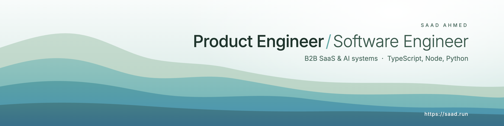
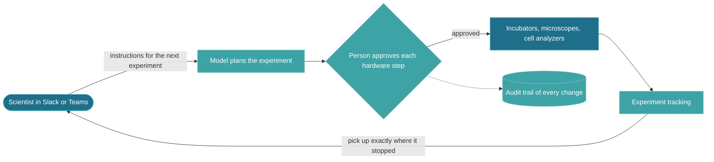
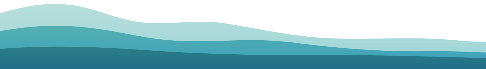

<picture>
  <source media="(prefers-color-scheme: dark)" srcset="assets/banner-dark.png">
  
</picture>

  

  
  
  

## 👋 About

I'm a product engineer at Teczon. I build B2B software with AI systems at its core, and each product I've worked on has been my responsibility from the requirement meetings and the first commit to keeping it running after launch.

The code for the work below lives in private company repositories.

## 🧪 Recent work

<table>
  <tr>
    <td width="30%" valign="top">🧫 <b>Lab automation for a cell-culture robot</b></td>
    <td valign="top">A scientist writes instructions for the next experiment in plain language, and the model plans the experiment and instructs the robot's incubators, microscopes and cell analyzers to perform it, with a person approving every hardware step before anything moves. Scientists use it from Slack and Microsoft Teams. It passed the full security assessment of a pharmaceutical customer valued at about $90B.</td>
  </tr>
  <tr>
    <td valign="top">🔐 <b>Business-mentor agent</b></td>
    <td valign="top">Advises each user from their own spreadsheets and financial documents. Personal details are stripped and sensitive values masked before anything reaches the model provider, including calls made from tools, and the masked values are restored in the answer.</td>
  </tr>
  <tr>
    <td valign="top">📄 <b>Document assistant for a public-sector organisation</b></td>
    <td valign="top">Citizens upload a document and ask questions about it. It runs on the organisation's own GPUs with an 8B Polish-language open-source model, because the data could not leave the country, and I engineered the layer that detects and fixes the model's broken tool calls.</td>
  </tr>
</table>

<b>How the lab agent fits together</b>

 

## 🧰 Stack

  <picture>
    <source media="(prefers-color-scheme: dark)" srcset="https://skillicons.dev/icons?i=ts,js,nodejs,nestjs,express,react,nextjs,tailwind,py,fastapi,postgres,prisma,docker,gcp,aws,git&perline=16&theme=dark">
    
  </picture>

  
  
  
  
  
  

## 🕹️ Arcade

> [!NOTE]
> These games play on my contribution graph and redraw every night. Most of the activity on it is in private company repositories.

<picture>
  <source media="(prefers-color-scheme: dark)" srcset="https://raw.githubusercontent.com/iamsaad640/iamsaad640/output/snake-dark.svg">
  
</picture>

<b>Two more games on the same graph</b>

 

<picture>
  <source media="(prefers-color-scheme: dark)" srcset="https://raw.githubusercontent.com/iamsaad640/iamsaad640/output/pacman-contribution-graph-dark.svg">
  
</picture>

<picture>
  <source media="(prefers-color-scheme: dark)" srcset="https://raw.githubusercontent.com/iamsaad640/iamsaad640/output/breakout-contribution-graph-dark.svg">
  
</picture>

